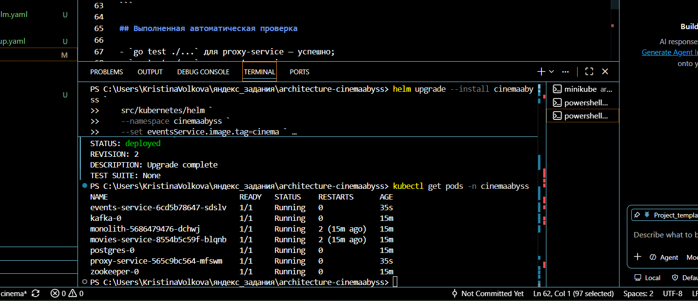
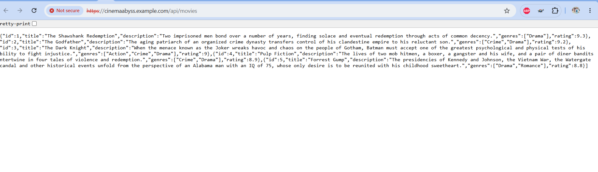

# CinemaAbyss — выполненное решение

> Исходное условие сохранено ниже. Реализованные файлы и результаты проверки перечислены в этом разделе.

## Задание 1 — To-Be архитектура

- [Контейнерная C4-диаграмма](docs/c4-container-to-be.puml)

Диаграмма показывает единую точку входа, доменные сервисы, отдельные хранилища, Kafka, внешние системы и временный legacy-монолит.

## Задание 2 — Proxy и Kafka

### Proxy / Strangler Fig

- [Исходный код](src/microservices/proxy/main.go)
- [Unit-тесты](src/microservices/proxy/main_test.go)
- [Dockerfile](src/microservices/proxy/Dockerfile)

Proxy направляет users/payments/subscriptions в монолит, events — в events-service, а movie-трафик переключает между монолитом и movies-service с помощью `GRADUAL_MIGRATION` и `MOVIES_MIGRATION_PERCENT`.

### Events / Kafka MVP

- [HTTP API](src/microservices/events/main.go)
- [Kafka producer/consumer](src/microservices/events/kafka.go)
- [Unit-тесты](src/microservices/events/main_test.go)
- [Dockerfile](src/microservices/events/Dockerfile)

Реализованы события Movie/User/Payment, публикация в три топика и consumer-циклы с записью обработанных сообщений в лог.

### Проверка

```bash
docker compose up -d --build
cd tests/postman
npm ci
npm run test:local
```

Скрины:
[docs/evidence топик кафки](docs/evidence/topic.png)
[docs/evidence запуск тестов](docs/evidence/test.png)

## Задание 3 — CI/CD и Kubernetes

- [Workflow сборки, тестов и публикации образов](.github/workflows/docker-build-push.yml)
- [Workflow проверки pull request](.github/workflows/api-tests.yml)
- [Events Deployment и Service](src/kubernetes/events-service.yaml)
- [Proxy Deployment и Service](src/kubernetes/proxy-service.yaml)
- [ConfigMap](src/kubernetes/configmap.yaml)
- [Ingress](src/kubernetes/ingress.yaml)
- [Инструкция по GHCR pull secret](src/kubernetes/README.md)

Ingress направляет `/api/events` в events-service, а остальные запросы — в proxy-service.
[docs/evidence топик кафки](docs/evidence/task3.png)
[docs/evidence API call](docs/evidence/API-call-task3.png)
[docs/evidence event log](docs/evidence/event-task3.png)
## Задание 4 — Helm

- [values.yaml](src/kubernetes/helm/values.yaml)
- [Proxy template](src/kubernetes/helm/templates/services/proxy-service.yaml)
- [Events template](src/kubernetes/helm/templates/services/events-service.yaml)
- [Ingress template](src/kubernetes/helm/templates/ingress.yaml)

### Результаты проверки Helm

Helm chart успешно установлен в namespace `cinemaabyss`.  
Релиз `cinemaabyss` находится в статусе `deployed`, а все компоненты
системы запущены и находятся в состоянии `Running`.



После развёртывания через Helm выполнена проверка API через Ingress.
Запрос `GET /api/movies` успешно вернул список фильмов.

